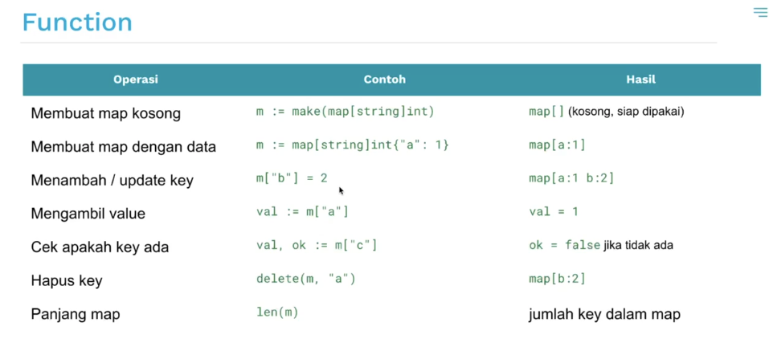

# Map
- map adalah struktur data yang menyimpan pasangan key - value.
- Ibarat seperti kamus: kamu cari kata (key), lalu dapet artinya (value).

## Karakteristik map
1. Key harus tipe data yang bisa dibandingkan (comparable)
   - Contoh: string, int, bool, float, dll.
2. Unique key, tidak boleh ada key yang sama, jika diset ulang maka value lama akan tertimpa
3. Value bisa tipe data apapun, bisa int, string, struct, bahkan slice.
4. Sifat un-ordered
   - Elemen dalam map tidak memiliki urutan tetap, walaupun ditampilkan dengan `fmt.Println`.
5. Akses cepat (0(1))
   - Go mengimplementasikan map menggunakan hash table, sehingga pencarian key dilakukan dengan cepat.

# Referensi
