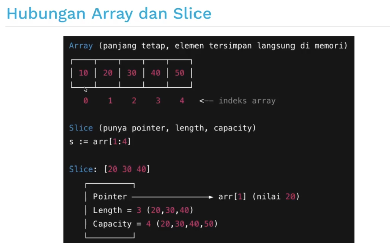

# 3 Komponen Utama Pada Slice
1. Pointer
- - Menunjuk ke elemen pertama dari array dibawahnya (bukan selalu elemen ke-0 array, bisa ditengah)
- - Jadi slice hanyalah "jendela" yang mengakses sebagian dari array.
2. Length `(len)`
- - Panjang slice saat ini, yaitu jumlah elemen yang bisa digunakan. Didapat dengan fungsi `len(slice)`
3. Capacity `(cap)`
- - Kapasitas maksimum slice, dihitung dari posisi pointer hingga akhir array. Didapat dengan fungsi `cap(slice)`

| Cara membuat slice | Contoh kode | penjelasan |
|-|-|-|
| Slice seluruh array | s := arr[:] | Slice mengambil semua elemen array |
| Slice dari indeks awal ke tertentu  | s := arr[:3] | Slice dari indeks 0 sampai 2 (tidak termasuk 3) |
| Slice dari indeks tertentu ke akhir | s := arr[2:] | Slice dari indeks 2 sampai akhir |
| Slice dari indeks `i` ke `j` | s := arr[1:4] | Slice dari indeks 1 sampai 3 (tidak termasuk 4) |

## Referensi

# Function
| Fungsi | Deskripsi | Contoh Penggunaan | Hasil |
|-|-|-|-|
| len(slice) | Mengembalikan panjang slice (jumlah elemen yang ada) | len([]int{1,2,3}) | 3 |
| cap(slice) | Mengembalikan kapasitas slice (jumlah elemen maksimum yang bisa ditampung sebelum realokasi) | cap(make([]int, 3, 4)) | 5 |
| append(slice, elem..) | Menambahkan elemen baru ke slice, jika penuh akan membuat array baru | append([]int{1,2,3}, 3, 4) | [1 2 3 4] |
| copy(dst, src) | Menyalin elemen dari slice `src` ke `dst`, mengembalikan jumlah elemen yang tersalin | copy([]int{0,0,0}, []int{1,2}) | 2 |
| make([]T, len, cap) | Membuat slice baru dengan panjang `len` dan kapasitas `cap` | make([]int, 3, 5) | [0 0 0] |
| s[i:j] | Membuat slice baru dari indeks. `i` hingga `j-1` dari slice/array asal | s := []int{1,2,3,4}; s[1:3] | [2 3] |