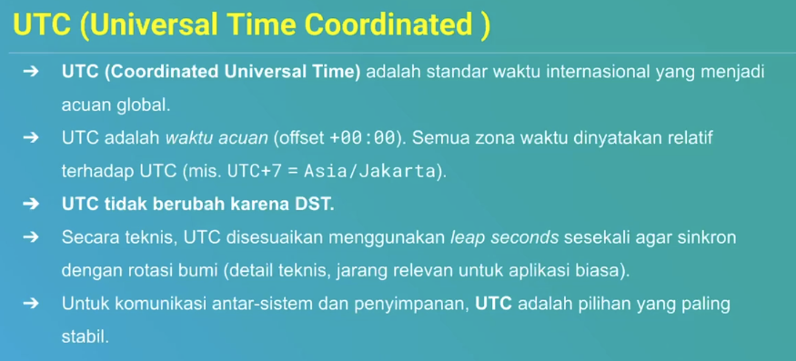
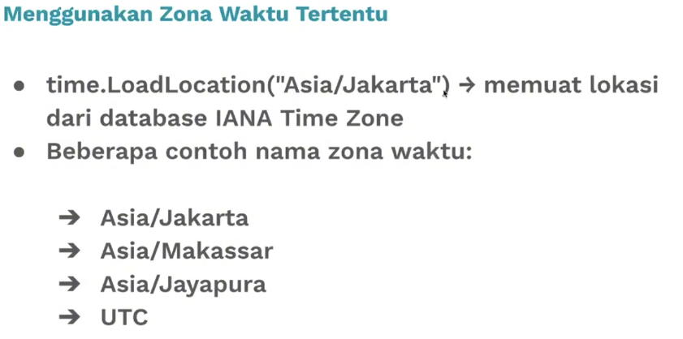
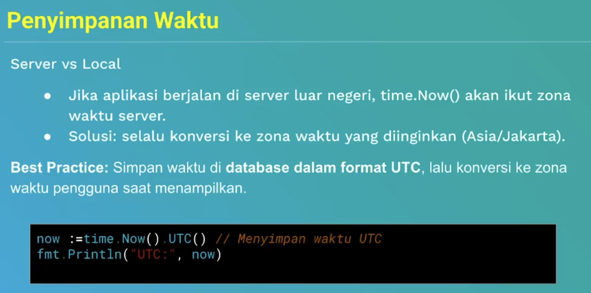

# Time
Di Go, tipe data waktu dan tanggal disediakan oleh package `time`.

Tipe utamanya adalah:
- time.Time
   - merepresentasikan satu titik waktu (tanggal, jam, timezone)
- time.Duration
   - merepresentasikan selisih waktu (misalnya 5 detik, 2 jam)

## Zona waktu
- time.Time selalu menyimpan zona waktu (biasanya default mengikuti sistem/OS)
- Zona waktu mempengaruhi cara waktu ditampilkan, tetapi nilai UTC-nya tetap sama.
- Go mendukung:
   - UTC -> waktu universal
   - Local -> Zona waktu lokal (mengikuti OS/server)
   - Custom Location -> Zona waktu tertentu seperti "Asia/Jakarta"

## Referensi

